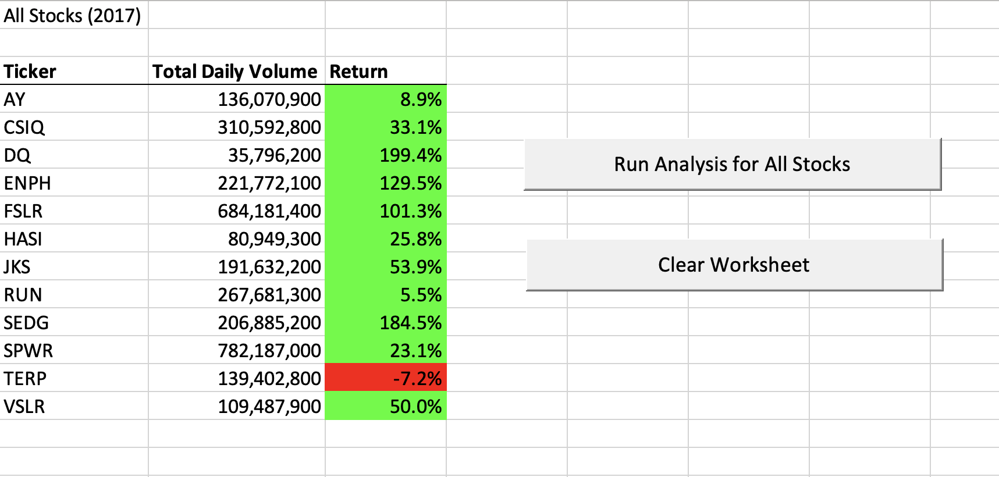
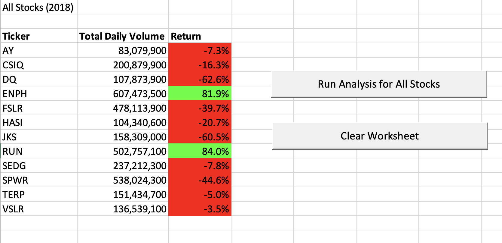
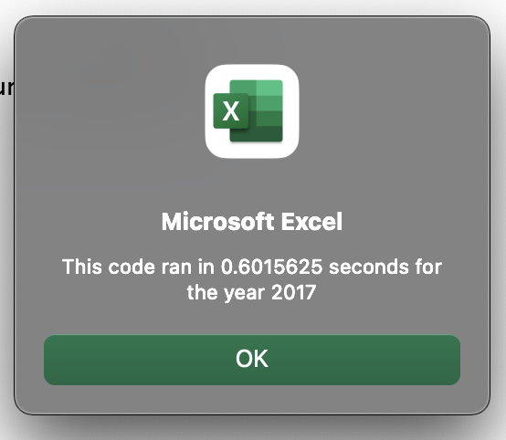
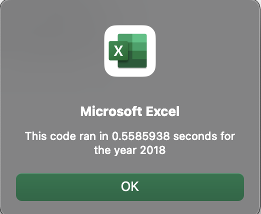
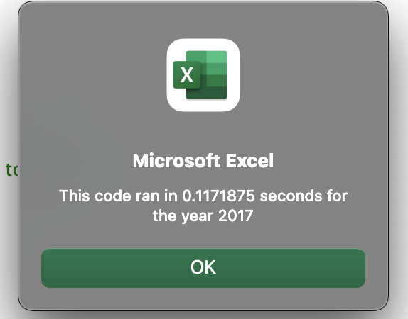
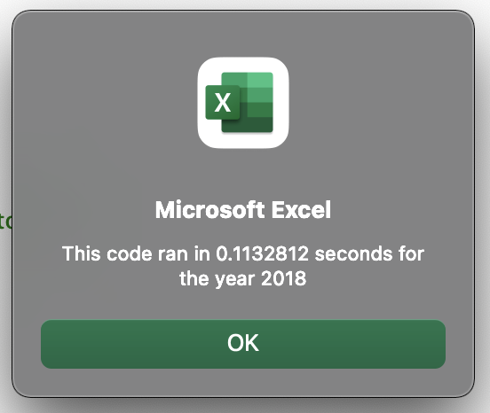

# stock-analysis
Module 2 stock analysis 
## Overview of Project
### Purpose

The purpose of this project is to refactor the code that was created to help Steve's parents with stock analysis on Module 2. The code worked well for the 12 stocks for 2017 and 2018 but Steve now wants to expand the datasets to include the thousands of stocks for the past few years. By refactoring the code, the VBA script can be more efficient to run faster for the thousands of stocks. 

## Results
### Compare the stock performance between 2017 and 2018
According to the table for 2017 stock analysis, 11 out of 12 stocks resulted in positive returns, which means the investments for these stocks grew in 2017. Only "TERP" stock shrunk by 7.2% in 2017. According to the table for 2018 stock analysis, 10 out of 12 stocks resulted in negative returns and only "ENPH" and "RUN" stocks grew in 2018. The stocks performed better in 2017 compared to 2018.

### The execution times of the original script and the refactored script
The execution time of the original script for 2017: 0.601562 seconds

The execution time of the refactored script for 2017: 0.1171875 seconds

The execution time of the original script for 2018: 0.5585938 seconds

The execution time of the refactored script for 2018: 0.1132812 seconds

As shown on the above, the execution time of the refactored script was much faster than the original script.

## Summary
### The advantages and disadvantages of refactoring code in general
The advantage of refactoring code is that it can make the codes cleaner and more efficient. 
The disadvantage of refactoring code is that you would be lost where to start from if you did not create the original script. It would probabaly take longer than you expected to fully understand the original script so you can start refactoring codes. It can be time consuming so it probably would be easier to start from the scratch.

### The advantages and disadvantages of the original and refactored VBA script
The original VBA script works well but it probably wouldn't work or take longer for the extended dataset. Unlike the original VBA script, the refactored VBA script is cleaner and runs fater so it would work well for the extended dataset, and perform better on a much larger dataset.

